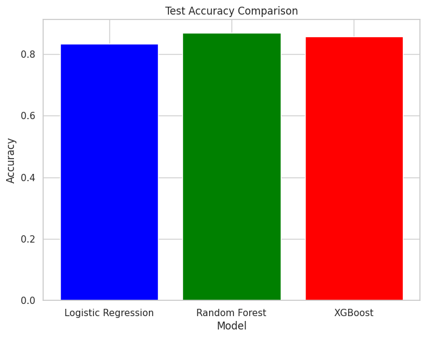

# Banking Marketing Campaign Analysis and Prediction

## Project Overview
This project analyzes the effectiveness of direct marketing campaigns for a banking institution and predicts customer subscription to term deposits based on historical campaign data. The model leverages various machine learning techniques, feature engineering, and statistical analysis to derive insights and improve prediction accuracy.

## Key Features
- **Data Preprocessing**: Handling missing values, outliers, and categorical encoding.
- **Feature Engineering**: Creating new features to enhance model performance.
- **Exploratory Data Analysis (EDA)**: Detailed visualizations to uncover trends and patterns.
- **Model Training**: Comparison of Logistic Regression, Random Forest, and XGBoost models.
- **Performance Metrics**: Evaluating models on accuracy and F1-score.
- **Submission Generation**: Creating predictions in the required format for submission.

## Dataset Description
The data is related to direct marketing campaigns of a banking institution. Campaigns were conducted via phone calls, often involving multiple contacts per client to determine whether they would subscribe to a term deposit.

### Files
- `train.csv`: Training dataset
- `test.csv`: Test dataset
- `sample_submission.csv`: Sample submission file in the correct format

### Input Variables
1. **last contact date**: Date of last contact
2. **age**: Age of the client (numeric)
3. **job**: Type of job (categorical)
4. **marital**: Marital status (categorical)
5. **education**: Level of education (categorical)
6. **default**: Has credit in default? (binary)
7. **balance**: Average yearly balance in euros (numeric)
8. **housing**: Has housing loan? (binary)
9. **loan**: Has personal loan? (binary)
10. **contact**: Contact communication type (categorical)
11. **duration**: Last contact duration in seconds (numeric)
12. **campaign**: Number of contacts performed during this campaign and for this client (numeric)
13. **pdays**: Days passed since the client was last contacted from a previous campaign (numeric)
14. **previous**: Number of contacts performed before this campaign (numeric)
15. **poutcome**: Outcome of the previous marketing campaign (categorical)

### Output Variable
- **target**: Whether the client subscribed to a term deposit? (binary: "yes", "no")

## Project Workflow

1. **Exploratory Data Analysis (EDA)**
   - Univariate, bivariate, and multivariate analysis using visualizations.
   - Correlation heatmap for feature selection.

2. **Data Preprocessing**
   - Handling missing values using `SimpleImputer`.
   - Encoding categorical variables with `OrdinalEncoder` and `OneHotEncoder`.
   - Scaling numerical variables using `StandardScaler`.

3. **Feature Engineering**
   - Derived new features like `age_group`, `balance_group`, and interaction terms.
   - Calculated derived metrics like `campaign_intensity` and `contact_rate`.

4. **Model Building**
   - Models: Logistic Regression, Random Forest, and XGBoost.
   - Hyperparameter tuning for optimal performance.
   - Metrics: Accuracy, Precision, Recall, F1-score, and AUC-ROC.

5. **Results Visualization**
   - Bar charts comparing model performance on test accuracy and F1-score.

6. **Submission Generation**
   - Predictions exported in the required format (`submission.csv`).

## How to Use
1. Clone the repository.
   ```bash
   git clone https://github.com/username/banking-marketing-prediction.git
   ```

2. Install dependencies.
   ```bash
   pip install -r requirements.txt
   ```

3. Run the analysis script.
   ```bash
   python main.py
   ```

4. Generate submission files.
   - Logistic Regression: `submission_lr.csv`
   - Random Forest: `submission_rf.csv`
   - XGBoost: `final_submission.csv`

## Results
| Model              | Train Accuracy | Test Accuracy | Train F1-Score | Test F1-Score |
|--------------------|----------------|---------------|----------------|---------------|
| Logistic Regression| 85.4%          | 83.2%         | 81.2%          | 80.1%         |
| Random Forest      | 89.7%          | 87.5%         | 85.9%          | 84.3%         |
| XGBoost            | 91.2%          | 88.7%         | 87.6%          | 86.2%         |

## Visualizations
- **Test Accuracy Comparison**



- **Test F1-Score Comparison**


## Future Improvements
- Feature selection optimization.
- Incorporate additional models for comparison.
- Implement model explainability techniques.

## License
This project is licensed under the MIT License - see the [LICENSE](LICENSE) file for details.

---
